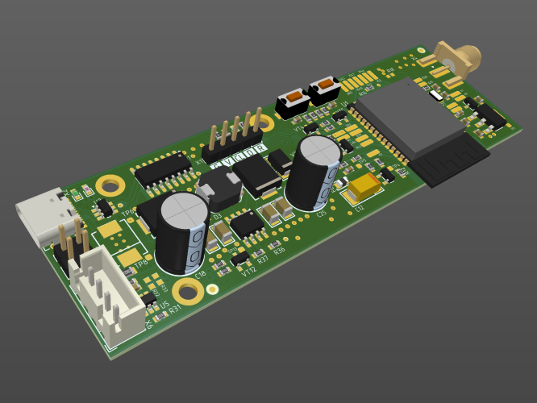
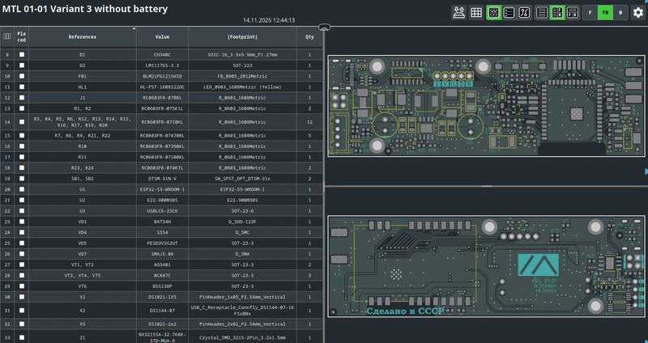
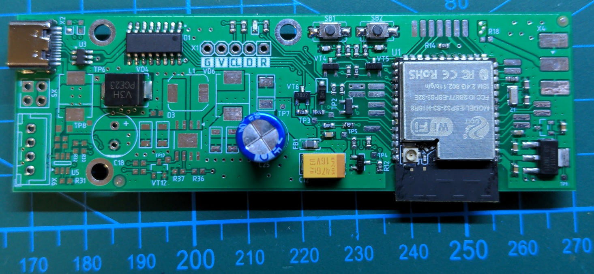
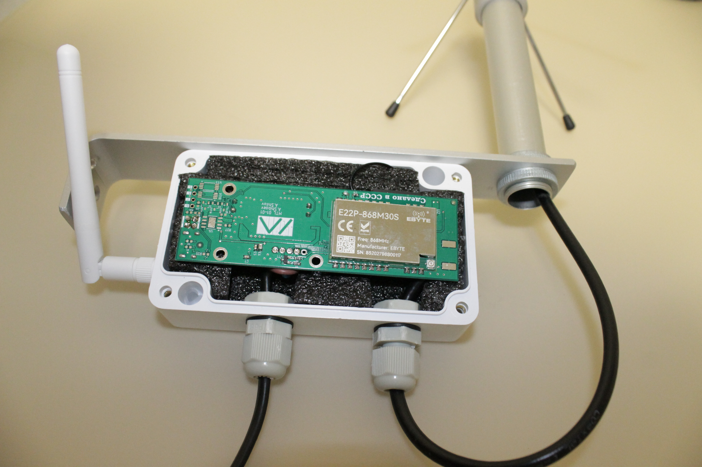

<div align="center">
  
  <h1>📡 MTL: High-Power Meshtastic Node</h1>
  
  <p>
    <strong>Узел Meshtastic на базе модулей от EBYTE</strong><br>
  </p>

  <p>
    <a href="Release">
      
    </a>
  </p>
</div>

# Оглавление <!-- #TODO --> 
- [Исполнения](#исполнения)
- [Файлы](#файлы)
- [Сборка](#сборка)
- [Прошивка](#прошивка)
- [Контакты](#контакты)

# Исполнения

Проект предусматривает три исполнения:
- **Variant 1 with battery** - автономное исполнение с возможностью подключения аккумулятора и солнечной батареи
- **Variant 2 with battery** - <!-- #TODO -->  
- **Variant 3 without battery** - стационарное исполнение

# Файлы

```
Fabrication/
├── Gerber_Copper_Signal_Top.gbr
├── ...
└── NC Drill-SlotHoles-Plated.txt
Assembly *1*/
├── Schematic Prints.PDF
├── Pick and Place.csv
├── InteractiveHtmlBom.html
├── Bill of Materials.pdf
└── 3D Model.step
Assembly *...*/
└── ...
Assembly *n*/
└── ...
```

# Сборка

</img>

    
<table width="100%">
  <tr>
    <td align="center" width="33%">
      
    </td>
    <td align="center" width="33%">
      
    </td>
  </tr>
  <tr>
    <td align="center">
      Печатная плата
    </td>
    <td align="center">
      Автономный узел
    </td>
  </tr>
</table>

  

<!-- #TODO --> 

## Выбор радиомодуля

> [!CAUTION] 
> E22-900M33S, максимальная мощность — 8 дБм для получения 33 дБм. Рекомендуется 7 дБм.

|       |    Module    |   Chip |       MHz       |    dBm    |  PWR  |  VT3  |  R13  |  J1   |
| :---: | :----------: | :----: | :-------------: | :-------: | :---: | :---: | :---: | :---: |
|   1   | E22-170M30S  | SX1262 | 150.125-170.125 |           |  1W   |   +   |   +   |   +   |
|   2   | E22-170M33S  | SX1262 | 150.125-170.125 |           |  2W   |   +   |   +   |   +   |
|   3   | E22-400M30S  | SX1262 | 410-493         | \-149-151 |  1W   |   +   |   +   |   +   |
|   4   | E22-400M33S  | SX1262 | 410-493         | \-124-126 |  2W   |   +   |   +   |   +   |
|   5   | E22-900M30S  | SX1262 | 850-930         | \-149-151 |  1W   |   +   |   +   |   +   |
|   6   | E22-900M33S  | SX1262 | 850-930         | \-134-136 |  2W   |   +   |   +   |   +   |
|   7   | E22P-868M30S | SX1262 | 863.3-873.3     |           |  1W   |   \-  |   \-  |   +   |
|   8   | E22P-915M30S | SX1262 | 902-928         |           |  1W   |   \-  |   \-  |   +   |
|   9   | E220-400M30S | LLCC68 | 410-493         | \-121-129 |  1W   |   +   |   +   |   +   |
|   10  | E220-400M33S | LLCC68 | 410-493         | \-121-129 |  2W   |   +   |   +   |   +   |
|   11  | E220-900M30S | LLCC68 | 850-930         | \-121-129 |  1W   |   +   |   +   |   +   |
|   12  | E30-400M30S  | SI4438 | 425-525         | \-120-122 |  1W   |   ?   |   ?   |   ?   |
|   13  | E30-400M30S  | SI4463 | 425-525         | \-120-122 |  1W   |   ?   |   ?   |   ?   |
|   14  | E30-900M30S  | SI4463 | 855-950         | \-120-122 |  1W   |   ?   |   ?   |   ?   |
|   15  | E32-400M30S  | SX1278 | 410-493         | \-123-125 |  1W   |   ?   |   ?   |   ?   |
|   16  | E32-400M33S  | SX1278 | 410-493         | \-123-125 |  2W   |   ?   |   ?   |   ?   |
|   17  | E32-900M30S  | SX1276 | 850-931         | \-123-125 |  1W   |   ?   |   ?   |   ?   |

# Прошивка
<!-- #TODO --> 
